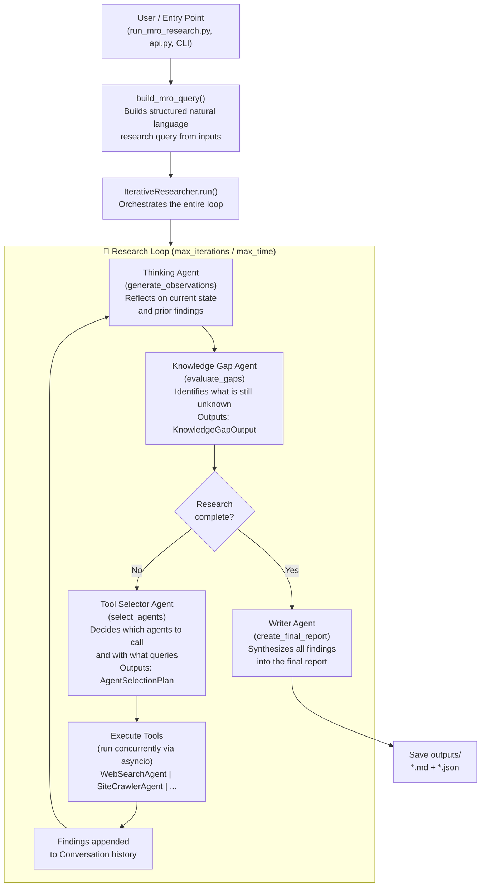
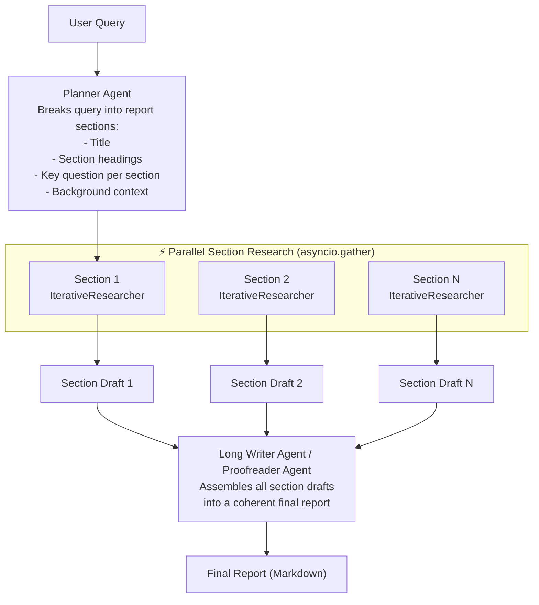
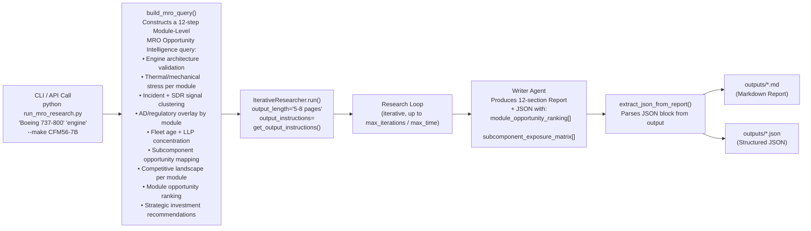
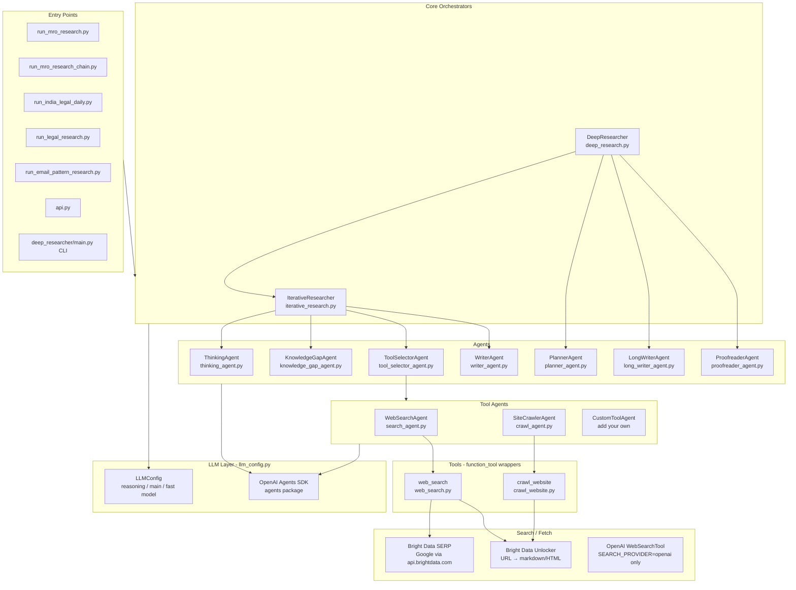
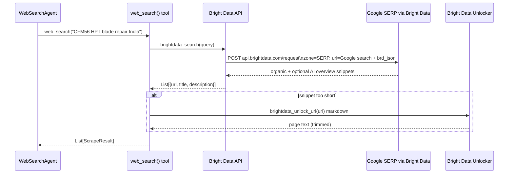
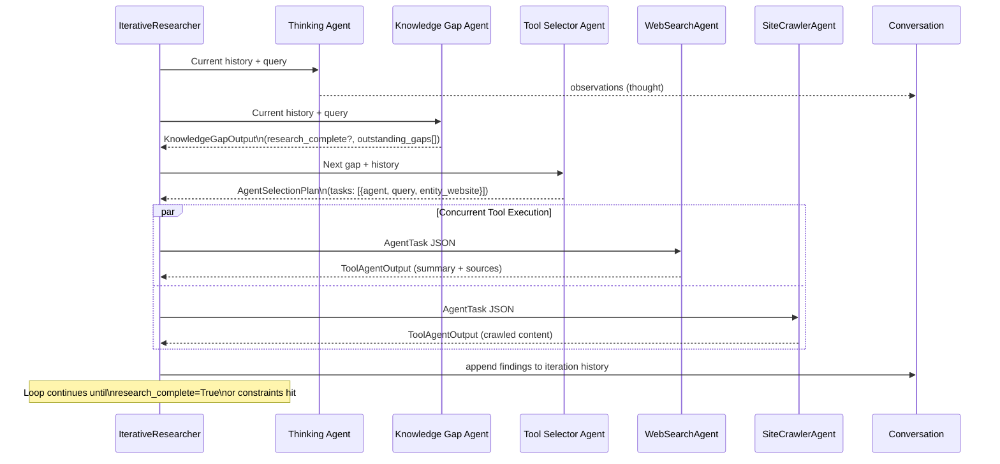

# 🏗️ Architecture Documentation — `agents-deep-research`

> A deep research assistant built on the **OpenAI Agents SDK**, using a multi-agent, iterative agentic loop to research any topic and produce structured intelligence reports.

---

## Table of Contents

1. [High-Level Overview](#high-level-overview)
2. [Two Research Modes](#two-research-modes)
3. [Flow Diagrams](#flow-diagrams)
   - [IterativeResearcher Flow](#iterativeresearcher-flow)
   - [DeepResearcher Flow](#deepresearcher-flow)
   - [MRO Report End-to-End Flow](#mro-report-end-to-end-flow)
4. [Component Diagram](#component-diagram)
5. [Component Reference](#component-reference)
   - [Entry Points](#entry-points)
   - [Core Orchestrators](#core-orchestrators)
   - [Agents](#agents)
   - [Tool Agents](#tool-agents)
   - [Tools (Underlying Integrations)](#tools-underlying-integrations)
   - [LLM Configuration](#llm-configuration)
6. [Search Integration: Bright Data SERP](#search-integration-bright-data-serp)
7. [How to Extend: Adding a Custom Tool Agent](#how-to-extend-adding-a-custom-tool-agent)
8. [Data Flow: One Research Iteration](#data-flow-one-research-iteration)
9. [File Structure Reference](#file-structure-reference)

---

## High-Level Overview

This is **not a simple chatbot**. It is a fully autonomous, multi-agent research system. When you give it a query, it:

1. Repeatedly identifies what it **doesn't know yet** (knowledge gaps)
2. Selects the right **specialized agents** to fill those gaps  
3. Runs those agents **in parallel** to gather real web data
4. **Reflects** on the findings to steer the next iteration
5. Produces a **final structured report** (Markdown + JSON)

The system is built on top of the [OpenAI Agents SDK](https://github.com/openai/openai-agents-python), which provides the underlying agent execution, tracing, and tool-calling runtime. All LLM providers (OpenRouter, DeepSeek, Gemini, Anthropic, etc.) are accessed through the same OpenAI-spec API wrapper.

**No MCP (Model Context Protocol).** Search and page unlock use plain Python HTTP calls (Bright Data SERP API, Bright Data Unlocker, etc.), wrapped as `@function_tool` callables that the OpenAI Agents SDK registers as tools for agents.

---

## Two Research Modes

| Mode                   | Class                 | Best For                                                                                                                    |
| ---------------------- | --------------------- | --------------------------------------------------------------------------------------------------------------------------- |
| **Simple / Iterative** | `IterativeResearcher` | Short to medium reports (up to ~5 pages). Runs a continuous loop.                                                           |
| **Deep**               | `DeepResearcher`      | Long, structured reports (20+ pages). Plans sections first, then runs parallel `IterativeResearcher` instances per section. |

Both can be used via Python, CLI (`deep-researcher`), or the FastAPI REST API (`api.py`).

---

## Flow Diagrams

### IterativeResearcher Flow

This is the core loop. Everything — including the `DeepResearcher` — is powered by this.



---

### DeepResearcher Flow



Both **Long Writer** and **Proofreader** use `fast_model` in code (`long_writer_agent.py`, `proofreader_agent.py`), not `main_model`.

---

### MRO Report End-to-End Flow

This is the concrete flow for `run_mro_research.py` — your MRO-specific entry point.



---

## Component Diagram



---

## Component Reference

### Entry Points

| File                            | Purpose                                                                                                                                                                                          |
| ------------------------------- | ------------------------------------------------------------------------------------------------------------------------------------------------------------------------------------------------ |
| `run_mro_research.py`           | CLI for Module-Level MRO Opportunity Intelligence. `aircraft`, `part`, `--make`, `--context`, `--max-iterations`, `--max-time`. Outputs `.md` + `.json` to `outputs/`.                          |
| `run_mro_research_chain.py`     | File-backed queue: chained MRO runs with related targets from the knowledge-gap agent.                                                                                                            |
| `run_india_legal_daily.py`      | India legal article pipeline: SERP discovery for **running/listed** matters (random **court tier** per run), queue by `--date`, `IterativeResearcherIndiaLegal`, per-run folder under `outputs/`.                                                |
| `run_legal_research.py`         | Legal pipeline on judgments (PDF/URL/DOCX/text) → structured `CaseRecord` JSON.                                                                                                                  |
| `run_email_pattern_research.py` | CLI to research corporate email patterns for a given company.                                                                                                                                 |
| `api.py`                        | FastAPI REST. `POST /research` starts background MRO research; status and report endpoints return paths.                                                                                         |
| `deep_researcher/main.py`       | Entrypoint for the `deep-researcher` CLI command installed via `pip`.                                                                                                                            |

---

### Core Orchestrators

#### `IterativeResearcher` (`deep_researcher/iterative_research.py`)

The heart of the system. Manages the research conversation via a `Conversation` object that tracks every iteration's:

- `gap` — the knowledge gap being addressed
- `tool_calls` — which agents were called and with what queries
- `findings` — what those agents returned
- `thought` — the thinking agent's reflection

**Loop constraints:** `max_iterations` (count) AND `max_time_minutes` (wall-clock). Whichever trips first ends the loop.

**Key methods:**

- `run(query, output_length, output_instructions)` — top-level method
- `_generate_observations()` → Thinking Agent
- `_evaluate_gaps()` → Knowledge Gap Agent  
- `_select_agents()` → Tool Selector Agent
- `_execute_tools()` → runs selected tool agents **concurrently** via `asyncio.as_completed()`
- `_create_final_report()` → Writer Agent

#### `DeepResearcher` (`deep_researcher/deep_research.py`)

Wraps `IterativeResearcher` for multi-section reporting:

1. **Planner Agent** → generates a `ReportPlan` (list of sections with key questions)
2. **asyncio.gather** → runs one `IterativeResearcher` per section in parallel
3. **Long Writer / Proofreader** → compiles section drafts into a coherent whole

---

### Agents

All agents are `ResearchAgent` instances (thin wrappers over the SDK's `Agent` class). Each has:

- A **system prompt** (instructions)
- A **model** (chosen from `LLMConfig`)
- An optional **output type** (Pydantic model for structured output) or **output parser** (fallback for models that don't support structured output natively)

| Agent               | Model Used        | Output Type / notes |
| ------------------- | ----------------- | ------------------- |
| Thinking Agent      | `reasoning_model` | Plain string        |
| Knowledge Gap Agent | `fast_model`      | `KnowledgeGapOutput` (incl. MRO related targets when complete) |
| Tool Selector Agent | `reasoning_model` | `AgentSelectionPlan` |
| Writer Agent        | `main_model`      | Plain string (final iterative report) |
| Planner Agent       | `reasoning_model` | `ReportPlan`        |
| Long Writer Agent   | `fast_model`      | Plain string (assembles section drafts; **not** `main_model`) |
| Proofreader Agent   | `fast_model`      | Plain string (**not** `main_model`) |

**India legal variants** (`legal_india_agents.py`, `iterative_research_legal_india.py`): LegalIndia knowledge-gap agent uses `fast_model`; LegalIndia tool selector uses `reasoning_model`. India discovery (`india_legal_discovery.py`): **all** `COURT_TIERS` within the SERP budget (one distinct query per tier first, then round-robin) + templates for listed/pending matters; `LAW_BRANCHES` remains the topic **branch** taxonomy for the compiler; SERP→topic compiler uses `main_model`.

---

### Tool Agents

Tool agents are the "hands" of the system — they actually go out and fetch data.

#### `WebSearchAgent` (`search_agent.py`)

- Takes an `AgentTask` (with `query`, `entity_website`, `gap`)
- Runs **one** `web_search()` call per task with the query provided (instructions tell the model not to rewrite the query)
- Uses Bright Data SERP by default (`SEARCH_PROVIDER=brightdata`); optional OpenAI native `WebSearchTool` when `SEARCH_PROVIDER=openai` and the active model is an OpenAI chat model
- Returns a `ToolAgentOutput` with summary and source URLs

#### `SiteCrawlerAgent` (`crawl_agent.py`)

- Takes an `AgentTask` with a specific website URL
- Crawls the site's pages
- Returns extracted content as a `ToolAgentOutput`

**How the Tool Selector Agent knows about available tool agents:** Their names and descriptions are listed in the Tool Selector Agent's system prompt in `tool_selector_agent.py`. **To add a new tool agent, you must update this prompt.**

---

### Tools (Underlying Integrations)

#### `web_search` (`deep_researcher/tools/web_search.py`)

This is a `@function_tool` — a Python function the SDK exposes to agents as a callable tool.

**Pipeline when `SEARCH_PROVIDER=brightdata` (default):**

1. `brightdata_search()` in `brightdata_tools.py` → POST to Bright Data `https://api.brightdata.com/request` with a Google SERP URL (`brd_json=1`, optional AI overview) → organic results (url, title, description)
2. Prefer SERP snippets where they are long enough; otherwise `scrape_urls()` → `brightdata_unlock_url()` per URL (Unlocker zone) → markdown/plain text up to `CONTENT_LENGTH_LIMIT` (10,000 chars)
3. Returns a list of `ScrapeResult(url, title, description, text)` objects

**Search provider selection (`LLMConfig.search_provider`):**

- `"brightdata"` → Bright Data SERP + Unlocker (requires `BRIGHTDATA_API_KEY`, `BRIGHTDATA_SERP_ZONE`, unlocker zone — see `.env.example`)
- `"openai"` → native SDK `WebSearchTool()` (only valid when the **fast** model is routed to OpenAI’s API; enforced in `search_agent.py`)
- Legacy env values like `serper` / `searchxng` are **not** implemented in current code; `llm_config.py` maps unknown values to `brightdata` where applicable or raises

---

### LLM Configuration

`LLMConfig` (`deep_researcher/llm_config.py`) defines three model roles:

| Role              | Default       | Used By |
| ----------------- | ------------- | ------- |
| `reasoning_model` | `o3-mini`     | Thinking Agent, Tool Selector Agent, Planner Agent; LegalIndia tool selector; India discovery **query planner** |
| `main_model`      | `gpt-4o`      | Writer Agent (final report); India discovery **topic compiler** from SERP digest |
| `fast_model`      | `gpt-4o-mini` | Knowledge Gap Agent (incl. LegalIndia gap), WebSearchAgent, SiteCrawlerAgent, EmailValidationAgent, CourtSearchAgent, Proofreader Agent, Long Writer Agent; legal pipeline tools under `deep_researcher/legal/tools/` |

**Supported providers:** `openai`, `deepseek`, `openrouter`, `gemini`, `anthropic`, `perplexity`, `huggingface`, `local` (Ollama/LM Studio), `azure_openai`

All non-OpenAI providers use `OpenAIChatCompletionsModel` with a custom `base_url` — so they all speak the same OpenAI API spec. This is why the code can switch between DeepSeek, Gemini, or a local Ollama model by just changing `.env` variables.

**Structured output fallback:** Not all providers support OpenAI's native structured output (`json_schema` response format). The `model_supports_structured_output()` function checks the provider's base URL. For providers that don't support it, agents use `output_parser` — a Pydantic-based text parser that extracts JSON from the LLM's plain text response.

---

## Search Integration: Bright Data SERP



**Key points:** Default search is **Bright Data** (not Serper). SERP results come from Google through Bright Data’s request API; thin snippets are augmented with the **Unlocker** for the same URL. The SDK only sees the `web_search()` `@function_tool`. Env: `BRIGHTDATA_API_KEY`, `BRIGHTDATA_SERP_ZONE` (or `BRIGHTDATA_ZONE`), and an unlocker zone for crawls.

---

## How to Extend: Adding a Custom Tool Agent

The system is designed to be extended. Here's the 4-step process:

### Step 1 — Create the tool (`deep_researcher/tools/`)

```python
# deep_researcher/tools/my_custom_tool.py
from agents import function_tool

@function_tool
async def my_tool(query: str) -> str:
    """Call my external API or data source."""
    # ... your HTTP call or logic here ...
    return result_as_string
```

### Step 2 — Create the tool agent (`deep_researcher/agents/tool_agents/`)

```python
# deep_researcher/agents/tool_agents/my_agent.py
from ...tools.my_custom_tool import my_tool
from ..baseclass import ResearchAgent
from . import ToolAgentOutput

INSTRUCTIONS = """You are a specialized research agent...
Output one JSON object with concrete values for fields in ToolAgentOutput (not a JSON Schema / $defs block)."""

def init_my_agent(config) -> ResearchAgent:
    return ResearchAgent(
        name="MyCustomAgent",
        instructions=INSTRUCTIONS,
        tools=[my_tool],
        model=config.fast_model,
        output_type=ToolAgentOutput,
    )
```

### Step 3 — Register the agent (`deep_researcher/agents/tool_agents/__init__.py`)

```python
from .my_agent import init_my_agent

def init_tool_agents(config) -> dict:
    return {
        "WebSearchAgent": init_search_agent(config),
        "SiteCrawlerAgent": init_crawl_agent(config),
        "MyCustomAgent": init_my_agent(config),   # ← add here
    }
```

### Step 4 — Tell the Tool Selector Agent (`tool_selector_agent.py`)

Add a line to the `INSTRUCTIONS` string:

```
- MyCustomAgent: Retrieve data from [describe your source] when [describe the use case]
```

The LLM will now autonomously decide to call your agent when the knowledge gap matches.

---

## Data Flow: One Research Iteration



---

## File Structure Reference

```
agents-deep-research/
│
├── run_mro_research.py              # MRO Opportunity Intelligence CLI
├── run_mro_research_chain.py        # Queued / chained MRO research
├── run_india_legal_daily.py         # India legal daily article pipeline
├── run_legal_research.py            # Legal judgment → CaseRecord JSON
├── run_email_pattern_research.py    # Email pattern research CLI
├── api.py                           # FastAPI REST server
│
├── deep_researcher/                 # Core library
│   ├── __init__.py                  # Exports: IterativeResearcher, DeepResearcher, LLMConfig
│   ├── iterative_research.py        # IterativeResearcher + Conversation class
│   ├── iterative_research_legal_india.py  # India legal article loop
│   ├── india_legal_discovery.py     # Random court tier SERP (running/listed matters) → topic compilation
│   ├── deep_research.py             # DeepResearcher (multi-section)
│   ├── llm_config.py                # LLMConfig, provider_mapping, model helpers
│   ├── main.py                      # CLI entry (deep-researcher command)
│   │
│   ├── agents/
│   │   ├── baseclass.py             # ResearchAgent, ResearchRunner (SDK wrappers)
│   │   ├── thinking_agent.py        # Reflection / observations
│   │   ├── knowledge_gap_agent.py   # Gap identification
│   │   ├── tool_selector_agent.py   # AgentTask + AgentSelectionPlan
│   │   ├── writer_agent.py          # Final report writer
│   │   ├── planner_agent.py         # Report outline planner
│   │   ├── long_writer_agent.py     # Multi-section report writer
│   │   ├── proofreader_agent.py     # Final proofreading pass
│   │   ├── legal_india_agents.py    # India legal gap + tool selector agents
│   │   │
│   │   ├── tool_agents/
│   │   │   ├── __init__.py          # init_tool_agents() registry
│   │   │   ├── search_agent.py      # WebSearchAgent
│   │   │   └── crawl_agent.py       # SiteCrawlerAgent
│   │   │
│   │   └── utils/
│   │       └── parse_output.py      # Pydantic output parser fallback
│   │
│   ├── tools/
│   │   ├── web_search.py            # web_search() @function_tool (Bright Data SERP + Unlocker)
│   │   ├── brightdata_tools.py      # brightdata_search, brightdata_unlock_url
│   │   └── crawl_website.py         # crawl_website() @function_tool
│   │
│   └── utils/
│       └── os.py                    # env var helpers
│
├── prompts/                         # Reference prompt files (not used by runtime)
├── outputs/                         # Generated reports (.md + .json)
├── examples/                        # Usage examples
└── tests/                           # Test suite
```

---

*Last updated: 2026-04-04 — aligned with `llm_config.py` agent wiring and Bright Data search stack.*
